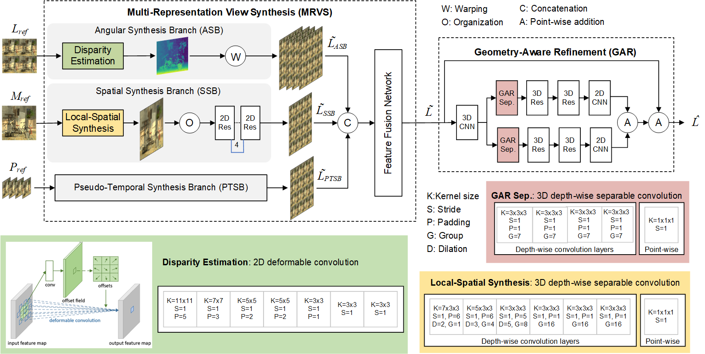

# deformable_lfvs
Light Field View Synthesis using Deformable Convolutional Neural Networks
## Abstract
Light Field (LF) imaging has emerged as a technology that can simultaneously capture both intensity values and directions of light rays from real-world scenes. Densely sampled LFs are drawing increased attention for their wide application in 3D reconstruction, depth estimation, and digital refocusing. In order to synthesize additional views to obtain a LF with higher angular resolution, many learning-based methods have been proposed. This paper follows a similar approach to Liu et al. [1] but using deformable convolutions to improve the view synthesis performance and depth-wise separable convolutions to reduce the amount of model parameters. The proposed framework consists of two main modules: i) a multi-representation view synthesis module to extract features from different LF representations of the sparse LF, and ii) a geometry-aware refinement module to synthesize a dense LF by exploring the structural characteristics of the corresponding sparse LF. Experimental results over various benchmarks demonstrate the superiority of the proposed method when compared to state-of-the-art ones. 

## Cite This Paper

If you use this work in your research, please cite the following paper:

### IEEE Style
Muhammad Zubair, Paulo Nunes, Caroline Conti, and Luís Ducla Soares, "Light Field View Synthesis Using Deformable Convolutional Neural Networks," in *2024 Picture Coding Symposium (PCS)*, 2024, pp. 1-5.

### BibTeX
```bibtex
@inproceedings{zubair2024light,
  title={Light Field View Synthesis Using Deformable Convolutional Neural Networks},
  author={Zubair, Muhammad and Nunes, Paulo and Conti, Caroline and Soares, Luis Ducla},
  booktitle={2024 Picture Coding Symposium (PCS)},
  pages={1--5},
  year={2024},
  organization={IEEE}
}
